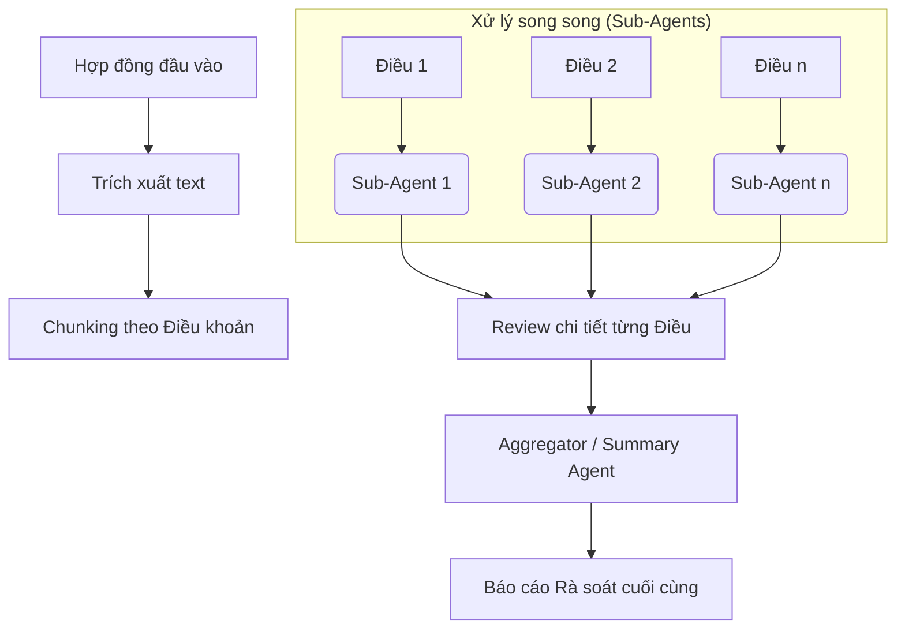

# Pipeline Rà Soát Hợp Đồng Toàn Diện

Tài liệu này mô tả luồng xử lý kỹ thuật khi một hợp đồng được đưa vào hệ thống để phân tích rủi ro pháp lý.

## 1. Kiến Trúc Tổng Quan: Sub-Agents Parallel Workflow

Thay vì đưa toàn bộ hợp đồng vào LLM (gây thiếu chi tiết và quá tải token), hệ thống sử dụng kiến trúc **Sub-Agents**: chia nhỏ hợp đồng và rà soát song song từng thành phần.

---

## 2. Chi Tiết Các Bước Trong Pipeline

### Bước 1: Trích xuất & Chunking (Section-based)
- **Cơ chế**: Sử dụng regex để nhận diện các tiêu đề "Điều X" trong văn bản hợp đồng.
- **Kết quả**: Một danh sách các `ContractClause` gồm tiêu đề và nội dung thô của điều khoản đó.

### Bước 2: Tìm kiếm Pháp luật liên quan (Per-Clause Retrieval)
- Với mỗi điều khoản hợp đồng, hệ thống thực hiện một truy vấn **Hybrid Search** vào cơ sở dữ liệu luật.
- Ví dụ: Một điều khoản về "Bồi thường thiệt hại" trong hợp đồng sẽ kích hoạt tìm kiếm các quy định về bồi thường trong Bộ luật Dân sự và Luật Thương mại.

### Bước 3: Phân tích Sub-Agent (LLM Reasoning)
- Mỗi agent nhận vào: (1) Nội dung 01 điều khoản hợp đồng và (2) Evidence Pack chứa các luật liên quan.
- **Nghiệp vụ**: Agent kiểm tra xem nội dung điều khoản có trái luật, thiếu sót thông tin bắt buộc, hoặc gây bất lợi quá mức cho người dùng không.
- **Định dạng đầu ra**: JSON chứa phân tích chi tiết, mức độ rủi ro (Cao/Trung bình/Thấp) và khuyến nghị sửa đổi.

### Bước 4: Tổng hợp & Báo cáo (Aggregation)
- Một LLM Agent cấp cao sẽ nhận toàn bộ kết quả từ các Sub-Agents.
- Nhiệm vụ:
    - Viết tóm tắt tổng quan về tính hợp pháp của hợp đồng.
    - Xếp hạng các rủi ro nghiêm trọng nhất.
    - Trình bày kết quả dưới dạng danh sách dễ đọc trên giao diện.

---

## 3. Ưu Điểm Của Pipeline Này

1. **Độ sâu (Depth)**: Do mỗi điều khoản được xử lý riêng với bộ luật tương ứng, phân tích sẽ sâu sắc hơn nhiều so với việc rà soát chung chung.
2. **Tính chính xác (Accuracy)**: Giảm thiểu hiện tượng "hallucination" (bịa đặt) của LLM vì mỗi bước đều được ép buộc sử dụng dữ liệu luật thật từ Retrieval.
3. **Hiệu năng (Performance)**: Sử dụng `asyncio` để chạy song song các sub-agents, giúp giảm đáng kể thời gian chờ đợi đối với các hợp đồng dài.
