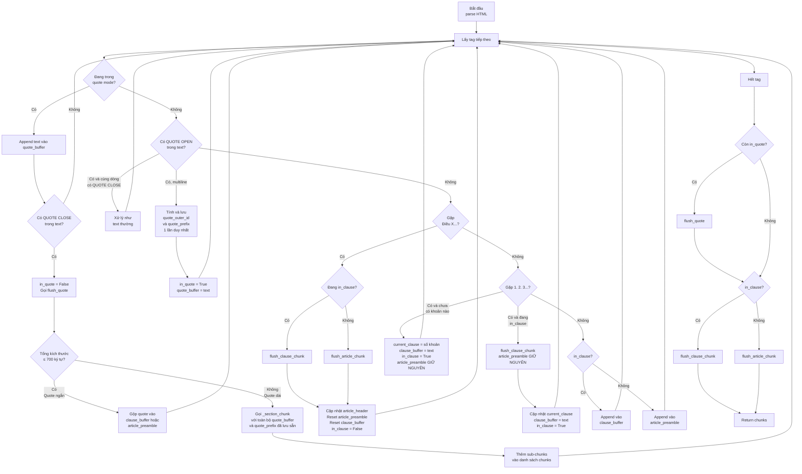
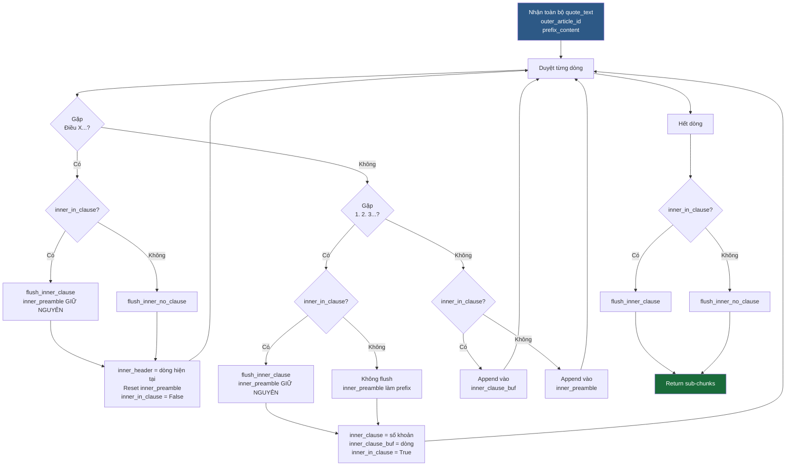

# Chiến lược Chunking văn bản pháp lý HTML

## Tổng quan

Hệ thống chia văn bản pháp lý HTML thành các chunk nhỏ theo cấu trúc Điều/Khoản của luật Việt Nam.  
Mỗi chunk phải đảm bảo **ngữ cảnh đầy đủ** — không có chunk nào chỉ là tiêu đề trống.

---

## Các biến trạng thái

| Biến | Kiểu | Vai trò |
|---|---|---|
| `article_header` | `str` | Dòng "Điều X. ..." → chỉ dùng cho `article_id` metadata |
| `article_preamble` | `list[str]` | Các dòng text giữa tiêu đề Điều và Khoản đầu tiên → **prefix content** |
| `current_clause` | `str` | Số khoản hiện tại ("1", "2", ...) |
| `clause_buffer` | `list[str]` | Nội dung khoản hiện tại đang tích lũy |
| `in_clause` | `bool` | Đang ở trong khoản hay không |
| `in_quote` | `bool` | Đang trong dấu ngoặc kép `" ... "` |
| `quote_buffer` | `list[str]` | Nội dung tích lũy trong dấu ngoặc kép |
| `quote_outer_id` | `str` | `article_id` của khoản/điều bên ngoài — lưu khi vào quote |
| `quote_prefix` | `str` | Prefix bên ngoài — lưu **1 lần duy nhất** khi bắt đầu quote |

---

## Quy tắc tạo chunk

### Chunk cấp Điều (không có Khoản)
```
content   = article_header + "\n" + join(article_preamble)
article_id = article_header
```

### Chunk cấp Khoản
```
content   = join(article_preamble) + "\n" + join(clause_buffer)
article_id = "Khoản X, Điều Y. ..."
```
> `article_preamble` được **giữ nguyên** khi flush từng khoản — dùng làm prefix cho tất cả khoản trong cùng 1 Điều.

### Chunk từ Quote ngắn (tổng ≤ 700 ký tự)
```
Gộp nội dung quote vào clause_buffer / article_preamble
→ Không tạo chunk riêng
```

### Sub-chunk từ Quote dài (tổng > 700 ký tự)
```
Gọi _section_chunk() với toàn bộ nội dung quote
Mỗi sub-chunk:
  content   = quote_prefix + inner_header + inner_preamble + inner_clause
  article_id = quote_outer_id  (context của khoản/điều bên ngoài)
```

---

## Luồng xử lý chính (`chunk_html_by_article`)



---

## Luồng `_section_chunk` (chia quote dài)



### Nội dung mỗi sub-chunk từ `_section_chunk`:

```
prefix_content      ← nội dung Điều + Khoản bên ngoài
inner_header        ← "Điều X..." bên trong quote
inner_preamble      ← text giữa inner Điều và inner Khoản đầu tiên
inner_clause_buf    ← nội dung khoản bên trong quote
```

> **Lưu ý quan trọng**: `quote_prefix` được tính **1 lần duy nhất** ngay khi phát hiện `QUOTE_OPEN` và lưu vào `quote_prefix`. Tất cả sub-chunk đều dùng cùng `quote_prefix` này — đảm bảo prefix nhất quán ngay cả khi quote rất dài.

---

## Ví dụ minh họa

### Input
```
Điều 1. Sửa đổi, bổ sung một số điều của Luật sở hữu trí tuệ:
Luật này sửa đổi những điều sau:
1. Sửa đổi Điều 4:
"Điều 4. Giải thích từ ngữ
Trong Luật này, các từ ngữ dưới đây được hiểu như sau:
1. Quyền sở hữu trí tuệ là...    [nội dung dài > 700 ký tự tổng cộng]
2. Quyền tác giả là...
"
2. Sửa đổi Điều 10: ...
```

### Output chunks

| # | `article_id` | `content` (tóm tắt) |
|---|---|---|
| 1 | `Khoản 1, Điều 1. Sửa đổi...` | `Luật này sửa...\n1. Sửa đổi Điều 4:\n"Điều 4. Giải thích...\n1. Quyền sở hữu..."` |
| 2 | `Khoản 1, Điều 1. Sửa đổi...` | `Luật này sửa...\n1. Sửa đổi Điều 4:\n"Điều 4. Giải thích...\n2. Quyền tác giả..."` |
| 3 | `Khoản 2, Điều 1. Sửa đổi...` | `Luật này sửa...\n2. Sửa đổi Điều 10:...` |

> - Chunk #1 và #2: cùng `article_id` và cùng prefix `Luật này sửa...` + `1. Sửa đổi Điều 4:` + tiêu đề Điều trong quote.
> - Chunk #3: chuyển sang Khoản 2, prefix `article_preamble` vẫn giữ nguyên.

---

## File triển khai

- **Hàm chính**: [`chunk_html_by_article()`](src/ingestion.py)
- **Hàm phụ**: [`_section_chunk()`](src/ingestion.py)
- **Hằng số**: `QUOTE_SIZE_LIMIT = 700` (ký tự, tính trên tổng prefix + clause + quote)
- **Test script**: `python -m src.ingestion` (xem biến `FIXED_DOC_ID` cuối file)
