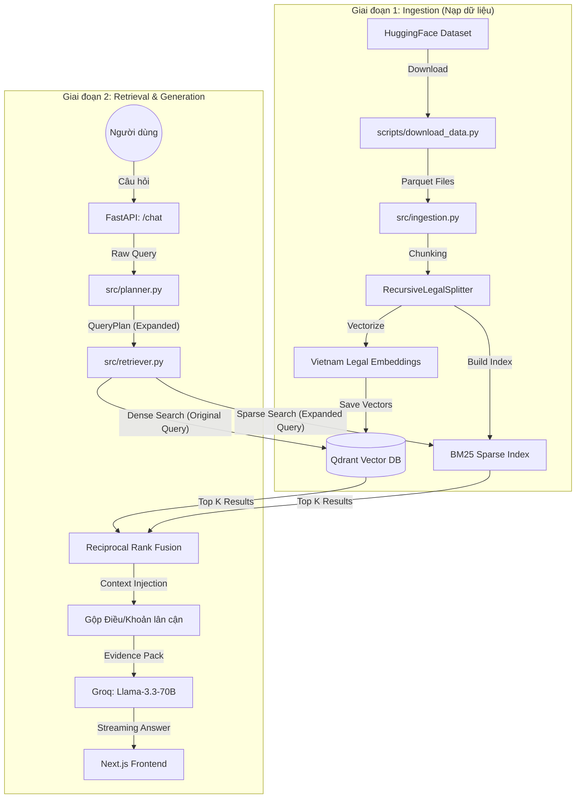

# Kiến Trúc Hệ Thống (System Architecture) — Trợ Lý Luật Việt Nam

Dự án này được xây dựng trên mô hình **RAG (Retrieval-Augmented Generation)** cấp độ sản xuất, cho phép AI trả lời các câu hỏi pháp lý dựa trên dữ liệu luật chính thống của Việt Nam với độ chính xác cao và có trích dẫn nguồn cụ thể.

### Tài liệu chuyên sâu:
- [Chi tiết Chiến thuật Chunking & Retrieval](file:///home/cuong/Desktop/python/VinUni/legal_AI_assistant/LEGAL_RAG_STRATEGY.md)
- [Chi tiết Pipeline Rà soát Hợp đồng](file:///home/cuong/Desktop/python/VinUni/legal_AI_assistant/CONTRACT_REVIEW_PIPELINE.md)

## 1. Luồng Hoạt Động (Data Flow)

Dưới đây là luồng xử lý từ lúc nạp dữ liệu cho đến khi người dùng nhận được câu trả lời:



---

## 2. Cấu Trúc Thư Mục (Directory Structure)

Dưới đây là sơ đồ tổ chức file và vai trò của từng phần:

```text
legal_AI_assistant/
├── src/                      # 🧠 Logic Backend (FastAPI + Python)
│   ├── main.py               # API Entry point (Endpoints: /chat, /ingest, /review)
│   ├── config.py             # Cấu hình hệ thống (Settings, API Keys)
│   ├── models.py             # Định nghĩa Schema (Pydantic models)
│   ├── database.py           # Quản lý Qdrant (Lưu trữ và tìm kiếm vector)
│   ├── ingestion.py          # Pipeline nạp dữ liệu (Load, Chunk, Upsert)
│   ├── retriever.py          # Bộ máy tìm kiếm lai (Hybrid Search + RRF)
│   ├── generator.py          # Bộ máy sinh văn bản (Prompting + LLM Integration)
│   ├── prompts/              # Chứa các bản mẫu câu lệnh cho AI (System Prompts)
│   └── utils/                # Tiện ích bổ trợ
│       ├── text_processing.py# Xử lý tiếng Việt, xóa HTML, tách Điều/Khoản
│       └── bm25_index.py     # Quản lý chỉ mục tìm kiếm từ khóa (Sparse Index)
├── frontend/                 # 🎨 UI Người dùng (Next.js + Tailwind)
│   ├── src/app/              # Layout & Page chính
│   ├── src/components/       # Các thành phần giao diện (Chat, Sidebar)
│   └── src/stores/           # Quản lý trạng thái (Zustand + SSE Integration)
├── scripts/                  # 🛠 Scripts bảo trì
│   └── download_data.py      # Tải dữ liệu từ HuggingFace về local
├── data/                     # 📂 Lưu trữ dữ liệu
│   ├── raw/                  # File Parquet gốc đã tải về
│   └── bm25/                 # File chỉ mục BM25 đã được build
├── Dockerfile                # Cấu hình đóng gói ứng dụng
├── docker-compose.yml        # Chạy đồng thời FastAPI và Qdrant
└── requirements.txt          # Danh sách thư viện Python
```

---

## 3. Các Thành Phần Chính & Vai Trò

### Backend (`src/`)
*   **`main.py`**: Điều phối toàn bộ ứng dụng, quản lý quá trình khởi tạo (lifespan) và cung cấp các API endpoints.
*   **`planner.py`**: Xử lý tiền kỳ câu hỏi (Query Planning). Dịch các từ viết tắt (VD: "BLHS" -> "Bộ Luật Hình Sự"), đồng nghĩa, phủ định trước khi đưa vào tìm kiếm.
*   **`retriever.py`**: Trái tim của hệ thống tìm kiếm. Nó thực hiện **Hybrid Search** — kết hợp thế mạnh của Vector Search (hiểu ý nghĩa câu hỏi gốc) và BM25 (tìm chính xác từ khóa pháp lý đã được mở rộng bởi Planner).
*   **`generator.py`**: Chịu trách nhiệm giao tiếp với LLM. Nó sử dụng kỹ thuật **Evidence-based Prompting** để bắt buộc AI chỉ trả lời dựa trên những bộ luật đã tìm thấy.
*   **`ingestion.py`**: Thực hiện "chia để trị" các văn bản luật dài hàng trăm trang thành các đoạn nhỏ (chunks) có ý nghĩa để AI dễ dàng xử lý.

### Frontend (`frontend/`)
*   **State Management**: Sử dụng **Zustand** để xử lý các luồng dữ liệu thời gian thực thông qua **SSE (Server-Sent Events)**, cho phép chữ hiện ra dần dần khi AI đang suy nghĩ.
*   **Design System**: Tailwind CSS v4 kết hợp với các component hiện đại để mang lại trải nghiệm premium giống như các ứng dụng AI hàng đầu.

### Data Layer
*   **Qdrant**: Cơ sở dữ liệu vector tốc độ cao, dùng để lưu trữ các "dấu vân tay số" (embeddings) của các Điều luật.
*   **Local Parquet**: Lưu trữ bản sao của dataset gốc để tránh tải lại nhiều lần từ internet, giúp tăng tốc độ nạp dữ liệu.
