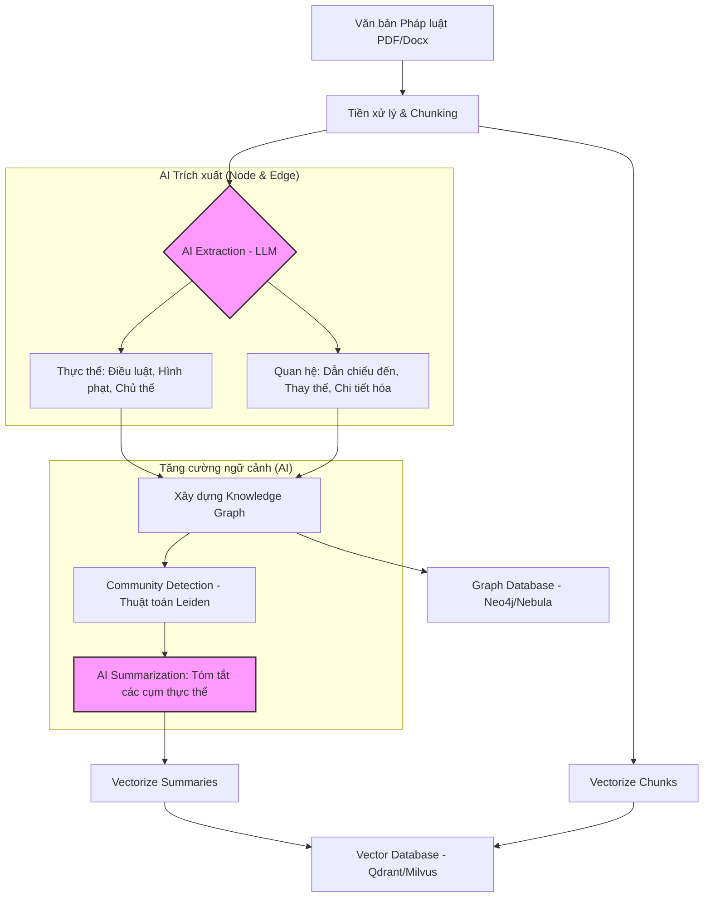
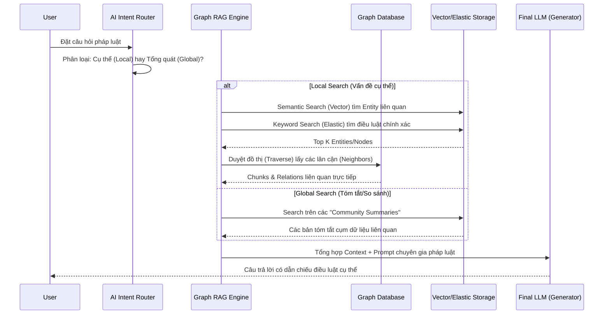

# Graph RAG for Legal AI Assistant: Architecture & Pipeline

Chào bạn, tôi là Senior AI Engineer. Dưới đây là mô tả chi tiết về hệ thống **Graph RAG** để áp dụng vào dự án trợ lý pháp luật. Graph RAG giải quyết điểm yếu của RAG truyền thống là "mất ngữ cảnh liên kết" bằng cách sử dụng Knowledge Graph để kết nối các thông tin rời rạc.

---

## 1. Quy trình Indexing (Luồng xây dựng dữ liệu)

Trong pháp luật, mối quan hệ giữa các điều luật, thông tư và nghị định là rất quan trọng. Quy trình Indexing không chỉ cắt nhỏ văn bản (chunking) mà còn phải "hiểu" mối quan hệ này.

*   **Lúc nào dùng AI?**
    *   **Extraction:** Dùng LLM để đọc từng chunk và trích xuất thực thể (Entities) và quan hệ (Relationships). Đây là bước tốn kém nhất.
    *   **Summarization:** Sau khi gom nhóm các thực thể vào "Community", dùng AI để viết tóm tắt cho từng cụm đó. Điều này giúp trả lời các câu hỏi mang tính vĩ mô.
*   **Lúc nào không dùng AI?**
    *   **Community Detection:** Sử dụng thuật toán toán học (như Leiden hoặc Louvain) để phân cụm đồ thị.
    *   **Vectorization:** Sử dụng Embedding Model (không phải LLM sinh văn bản).

---

## 2. Quy trình Search (Luồng truy vấn)

Hệ thống sẽ dựa vào loại câu hỏi của người dùng để quyết định dùng **Local Search** hay **Global Search**.

### Các loại Search sử dụng:
1.  **Vector Search:** Dùng để tìm kiếm ý nghĩa ngữ nghĩa (Semantic). Ví dụ: "vô ý làm chết người" có thể tìm ra các điều luật về "tai nạn giao thông".
2.  **Elastic Search (Keyword):** Cực kỳ quan trọng trong ngành luật để tìm chính xác số hiệu văn bản (Ví dụ: "Nghị định 100", "Điều 123").
3.  **Graph Search (Cypher/Gremlin):** Không dùng AI ở bước này, mà dùng thuật toán duyệt đồ thị để lấy tất cả các văn bản "dẫn chiếu" từ điều luật đang xét.

---

## 3. So sánh Local Search vs Global Search

| Đặc điểm | Local Search | Global Search |
| :--- | :--- | :--- |
| **Mục đích** | Trả lời về thực thể cụ thể, tiểu tiết. | Trả lời câu hỏi bao quát, xu hướng, so sánh. |
| **Cách hoạt động** | Tìm Node -> Duyệt Neighbors -> Lấy Chunks. | Tìm các Community Summaries (đã được AI tóm tắt khi Index). |
| **Ví dụ pháp luật** | "Mức phạt nồng độ cồn loại 1 là bao nhiêu?" | "Các chính sách mới hỗ trợ doanh nghiệp năm 2024?" |
| **Thành phần tham gia** | Vector Search + Graph Traversal. | Vector Search trên tóm tắt bậc cao. |

---

## 4. Tại sao Pháp luật cần Graph RAG?

1.  **Dẫn chiếu chéo (Cross-reference):** Một nghị định thường dẫn chiếu đến luật mẹ. RAG thường sẽ bỏ lỡ nếu luật mẹ nằm ở một file khác. Graph nối chúng lại bằng cạnh (Edge) `DẪN_CHIẾU`.
2.  **Hệ thống phân cấp (Hierarchy):** Cấu trúc Chương-Điều-Khoản là một cây (Tree). Graph DB lưu trữ cấu trúc này hoàn hảo hơn Vector DB phẳng.
3.  **Tránh ảo giác (Hallucination):** Bằng cách truy xuất "Neighbors" trên đồ thị, AI có đầy đủ các văn bản hướng dẫn thi hành kèm theo, giúp câu trả lời cực kỳ chính xác.

---

## 5. Giải quyết bài toán "Phân mảnh thông tin" (Fragmentation)

Một thách thức lớn trong pháp luật là thông tin thường bị **phân mảnh**: Luật chính nằm ở một văn bản, nhưng nội dung chi tiết nằm ở Nghị định, và mức phạt lại nằm ở Thông tư khác.

### Cách Graph RAG xử lý khi thông tin nằm ở nhiều file:

1.  **Cơ chế "Nhảy" (Lookup & Traverse):** 
    *   RAG thông thường dựa vào sự tương đồng (Similarity). Nếu 2 chunk ở 2 file khác nhau không dùng chung thuật ngữ, RAG sẽ bỏ lỡ.
    *   Graph RAG sử dụng **Quan hệ (Edges)**. Khi AI đã nhận diện được file A "dẫn chiếu" đến file B trong lúc Indexing, thì trong lúc Search, nó sẽ tự động đi theo "vết loang" này để thu thập thông tin từ file B ngay cả khi file B không chứa từ khóa tìm kiếm.

2.  **Cơ chế "Tổng hợp sớm" (Pre-synthesis via Communities):**
    *   Trong quá trình Indexing, thuật toán phân cụm (Community Detection) sẽ gom các Node từ nhiều nguồn khác nhau có liên quan mật thiết vào một "Cộng đồng".
    *   AI sẽ viết một bản tóm tắt (Summary) cho cộng đồng đó. Bản tóm tắt này chính là **cầu nối** xóa tan ranh giới giữa các file đơn lẻ.

### Ví dụ thực tế:
*   **Câu hỏi:** "Hành vi lấn chiếm vỉa hè bị xử lý như thế nào?"
*   **Thực tế:** Luật Đất đai (File 1) định nghĩa hành vi, Nghị định về Giao thông (File 2) đưa ra mức phạt, Thông tư hướng dẫn (File 3) quy định quy trình xử phạt.
*   **Kết quả:** 
    *   **Normal RAG:** Có thể chỉ lấy được File 1 hoặc File 2, dẫn đến câu trả lời thiếu bước thực hiện hoặc thiếu mức phạt.
    *   **Graph RAG (Local Search):** Tìm thấy Node "Lấn chiếm vỉa hè" -> Đi theo các cạnh liên kết để lấy thêm thông tin Mức phạt (File 2) và Quy trình (File 3) -> Trả lời đầy đủ, mạch lạc.

---

## 6. Deep Dive: Luồng xử lý khi Vector/Elastic Search thất bại

Đây là ví dụ thực tế về cách Graph RAG vượt qua giới hạn của tìm kiếm truyền thống thông qua cơ chế **Multi-hop Retrieval (Truy xuất đa bước)**.

### Kịch bản thực tế:
*   **Câu hỏi:** "Điều kiện ưu đãi thuế của Nghị định 10 là gì?"
*   **Dữ liệu thực tế:** 
    *   **File A (Nghị định 10):** Chỉ ghi "Giao cho Luật Thuế quy định".
    *   **File B (Luật Thuế):** Liệt kê chi tiết điều kiện nhưng không nhắc đến Nghị định 10.

### So sánh luồng xử lý:

| Bước | Vector/Elastic Search (Fail) | Graph RAG (Success) |
| :--- | :--- | :--- |
| **1. Tìm kiếm** | Tìm từ khóa "Ưu đãi thuế Nghị định 10". | Tìm thực thể (Node) "Nghị định 10". |
| **2. Kết quả sơ bộ** | Lấy được Chunk ở File A (Nội dung rỗng). | Tìm thấy Node A (Nghị định 10). |
| **3. Cơ chế nhảy** | **Không có.** Chỉ lấy những gì giống từ khóa. | **Graph Traversal:** Đi theo cạnh `DẪN_CHIẾU` để sang File B. |
| **4. Thu thập** | Chỉ lấy File A. | Lấy cả File A và nội dung chi tiết tại File B. |
| **5. Kết quả** | "Tôi không thấy điều kiện cụ thể trong Nghị định 10." | "Theo Nghị định 10 và dẫn chiếu từ Luật Thuế, điều kiện là..." |

### Tại sao Graph RAG thắng?
Cơ chế **Graph Traversal** cho phép hệ thống tìm ra những thông tin **liên quan về logic** nhưng **không tương đồng về từ ngữ**. Trong ngành luật, các văn bản dẫn chiếu lẫn nhau cực kỳ phức tạp, khiến cho các phương pháp tìm kiếm theo từ khóa (Elastic) hay theo ý nghĩa (Vector) đơn lẻ thường xuyên bị mất dấu thông tin quan trọng.

---

## 7. Khi tìm kiếm thất bại hoàn toàn (Zero-Hit Scenario)

Nếu Vector Search và Elastic Search không tìm thấy bất kỳ **Chunk** nào (do ngôn ngữ truy vấn quá khác biệt), Graph RAG vẫn có cơ chế "bảo hiểm" gọi là **Global Search dựa trên Community Summaries**.

### Tại sao vẫn tìm được khi Chunk Search trả về 0?

1.  **Tìm kiếm trên "Bản đồ" thay vì tìm trong "Kho":** 
    *   Lúc Indexing, AI đã gom nhóm hàng nghìn file/chunks thành các **Communities** (Cộng đồng) và tự viết tóm tắt cho từng cụm đó.
    *   Ví dụ: Bạn hỏi về "Vấn đề pháp lý của sàn TMĐT", nhưng văn bản chỉ dùng từ "Kinh doanh trực tuyến". Vector search chunk có thể hụt, nhưng **Community Summary** của cụm đó sẽ ghi: "Cộng đồng này thảo luận về các hoạt động thương mại trên internet và sàn giao dịch".
    *   Câu hỏi của bạn sẽ khớp (hit) với **Bản tóm tắt** này.

2.  **Quy trình Map-Reduce:**
    *   **Map:** Hệ thống quét qua tất cả các bản tóm tắt bậc cao (Level 0, Level 1).
    *   **Reduce:** Khi xác định được các Community liên quan, AI sẽ tổng hợp thông tin từ các bản tóm tắt đó để đưa ra câu trả lời bao quát, sau đó mới dẫn dắt người dùng xuống các chi tiết nằm trong cụm đó.

### Kết luận về khả năng xử lý của Graph RAG:
*   **RAG truyền thống:** Không thấy Chunk = Trả lời "Tôi không biết".
*   **Graph RAG:** Không thấy Chunk -> Tìm trên thực thể (Nodes) -> Không thấy thực thể -> Tìm trên tóm tắt chủ đề (Communities). Điều này đảm bảo hệ thống luôn có một cái nhìn **Toàn cảnh (Holistic View)** để hỗ trợ người dùng ngay cả khi thông tin bị che khuất.

---

## 8. Cơ chế điều hướng (Routing): Rule-based vs LLM Orchestrator

Để quyết định khi nào dùng Local Search, khi nào dùng Global Search, hoặc khi nào cần "Rollback", chúng ta có 3 chiến lược chính:

### Chiến lược 1: Rule-based Threshold (Dựa trên ngưỡng)
*   **Cơ chế:** Nếu điểm Similarity của Vector Search thấp hơn một ngưỡng (ví dụ 0.6), hệ thống tự động gọi Global Search.
*   **Phù hợp:** Hệ thống cần tốc độ nhanh và chi phí thấp.

### Chiến lược 2: Intent Router (LLM phân loại)
*   **Cơ chế:** Sử dụng một LLM giá rẻ (như GPT-4o-mini) để phân loại câu hỏi ngay từ đầu:
    *   *Intent: Specific* -> Local Search.
    *   *Intent: Holistic/Broad* -> Global Search.
*   **Phù hợp:** Hệ thống trợ lý luật cần sự chuyên nghiệp và hiểu ý người dùng.

### Chiến lược 3: Agentic Reasoning (Tự điều chỉnh)
*   **Cơ chế:** Hệ thống chạy Local Search trước. Một "Judge LLM" sẽ kiểm tra kết quả trả về. Nếu thông tin bị thiếu hụt hoặc không liên quan, Agent sẽ tự viết lại truy vấn và chuyển sang Global Search.
*   **Phù hợp:** Các bài toán pháp lý cực kỳ phức tạp, yêu cầu độ chính xác tuyệt đối và chấp nhận độ trễ (latency).

### Khuyến nghị cho dự án Pháp luật:
Nên bắt đầu với **Chiến lược 2 (Intent Router)**. Việc hiểu rõ người dùng đang hỏi về một "vụ việc cụ thể" hay "tìm hiểu chung" sẽ giúp hệ thống chọn đúng tầng dữ liệu ngay từ đầu, tránh lãng phí tài nguyên và tăng độ hài lòng của người dùng.

---
*Tài liệu được soạn thảo bởi Senior AI Engineer cho dự án Legal AI Assistant.*
