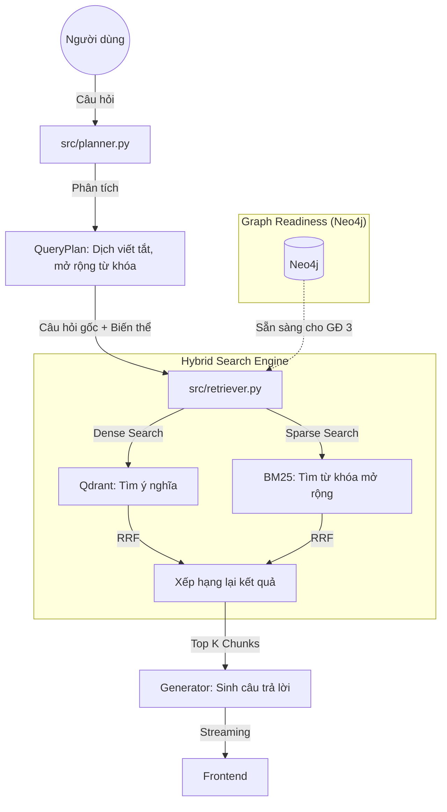

# Báo Cáo Giai Đoạn 2: Nâng Cấp Hạ Tầng Đồ Thị (Neo4j & Relationships)

Báo cáo này tổng hợp các hạng mục đã triển khai trong Giai đoạn 2, mức độ tái sử dụng mã nguồn và mô tả luồng hoạt động hiện tại của hệ thống.

## 1. Những Gì Đã Thay Đổi (Changes)
- **Thiết lập cơ sở dữ liệu đồ thị (Graph Database)**: Tích hợp Neo4j vào hệ thống thông qua Docker, cung cấp khả năng lưu trữ các mối liên kết giữa các văn bản pháp luật (ví dụ: Luật A được hướng dẫn bởi Nghị định B).
- **Phát triển Module `Neo4jManager`**: Xây dựng lớp quản lý kết nối bất đồng bộ, hỗ trợ thực thi truy vấn Cypher và tự động cấu hình các ràng buộc dữ liệu (Constraints) để đảm bảo tính toàn vẹn.
- **Xây dựng Script nạp quan hệ thông minh (`ingest_relationships.py`)**: 
  - Tự động tải và cache dữ liệu từ HuggingFace.
  - **Cơ chế lọc Postgres**: Chỉ nạp các mối quan hệ nếu cả hai đầu văn bản đều đã tồn tại trong cơ sở dữ liệu Postgres hiện tại của bạn. Điều này giúp đồ thị luôn sạch và khớp 100% với tập dữ liệu bạn đang sở hữu.

## 2. Những Gì Được Giữ Lại Từ Dự Án Chính (Kept from Main)
- **Luồng nạp văn bản gốc (Content Ingestion)**: Hoàn toàn giữ nguyên theo Phương án A. Chúng ta không thay đổi cách nạp HTML hay cách chunking hiện có để đảm bảo hiển thị UI đẹp mắt.
- **Cơ sở dữ liệu cũ**: Postgres và Qdrant vẫn đóng vai trò là "nguồn sự thật" (Source of Truth) cho nội dung và tìm kiếm ngữ nghĩa.

## 3. Những Gì Được Lấy Từ Reference (Taken from Reference)
- **Logic tải và parse Parquet**: Sử dụng kỹ thuật dùng `Polars` và `aiohttp` từ Reference để xử lý file `relationships.parquet` dung lượng lớn một cách hiệu quả.
- **Mô hình hóa dữ liệu (Data Modeling)**: Tái sử dụng cách định nghĩa các quan hệ (Cites, Amended_by, Guided_by...) từ dự án tham khảo.

### Mức Độ Tận Dụng Reference: ~70%
- **Logic lõi**: Khoảng 70% script nạp dữ liệu dựa trên kiến trúc của Reference.
- **Tùy biến (30%)**: Tôi đã viết mới hoàn toàn module kết nối Neo4j bất đồng bộ (`src/database_neo4j.py`) để phù hợp với kiến trúc FastAPI hiện tại của bạn và bổ sung lớp **Lọc thông minh bằng Postgres** mà Reference không có (Reference nạp mù quáng toàn bộ dataset).

## 4. Luồng Tìm Kiếm Câu Trả Lời (Search Flow) - Giai đoạn 2
Ở cuối Giai đoạn 2, luồng xử lý câu hỏi của người dùng như sau:

**Lưu ý quan trọng**: Trong Giai đoạn 2, chúng ta đã xây dựng xong "bản đồ" trong Neo4j. Tuy nhiên, để hệ thống thực sự "đi theo bản đồ" đó (ví dụ: tự động lấy thêm Nghị định khi người dùng hỏi về một Điều luật), chúng ta sẽ kích hoạt tính năng này trong **Giai đoạn 3 (GraphRAG)**. Hiện tại, Neo4j đóng vai trò là kho tri thức quan hệ đã được làm sạch và sẵn sàng để truy vấn.

## Kết Luận
Giai đoạn 2 đã hoàn thành việc xây dựng "nền móng tri thức" (Graph Infrastructure). Hệ thống bây giờ không chỉ hiểu ngôn ngữ (Semantic) mà còn có khả năng hiểu cấu trúc pháp luật (Relational).
